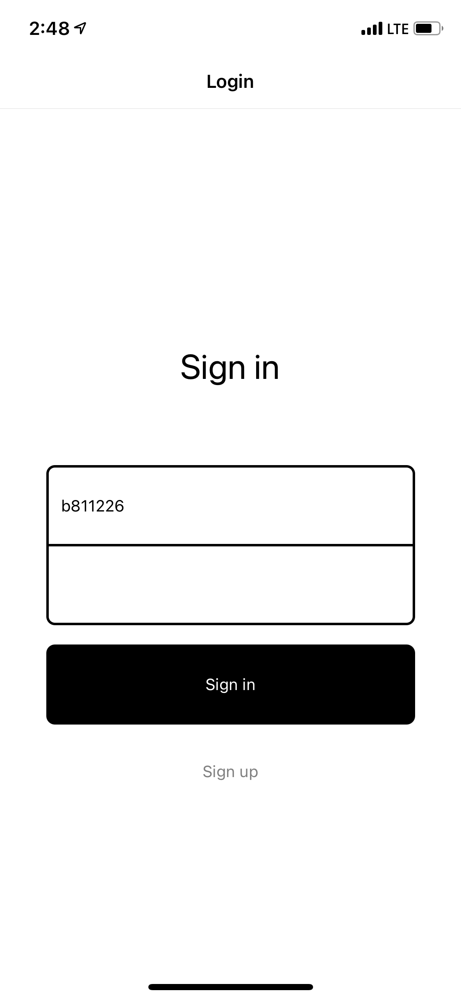
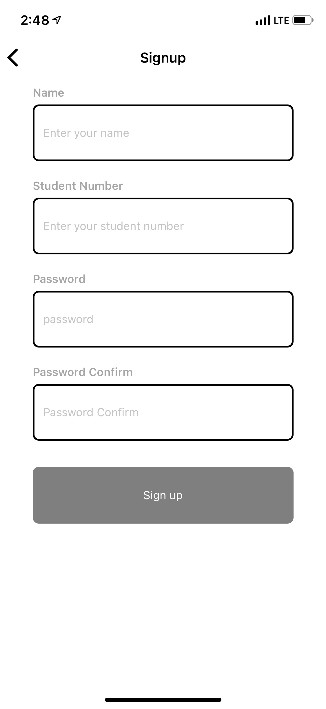
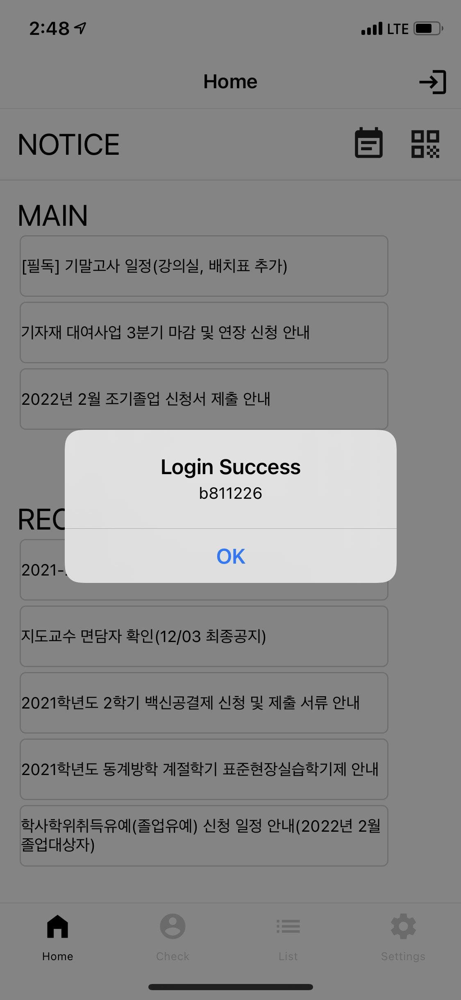
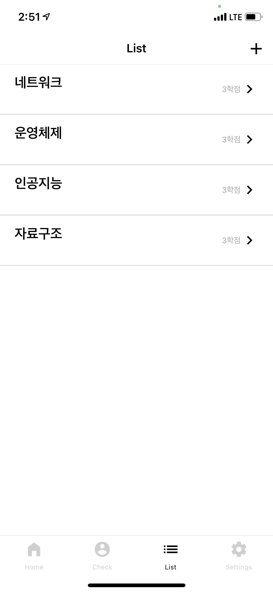
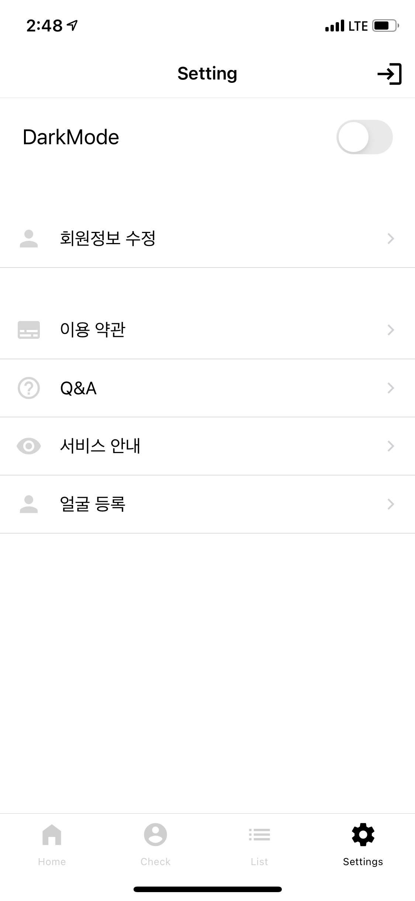
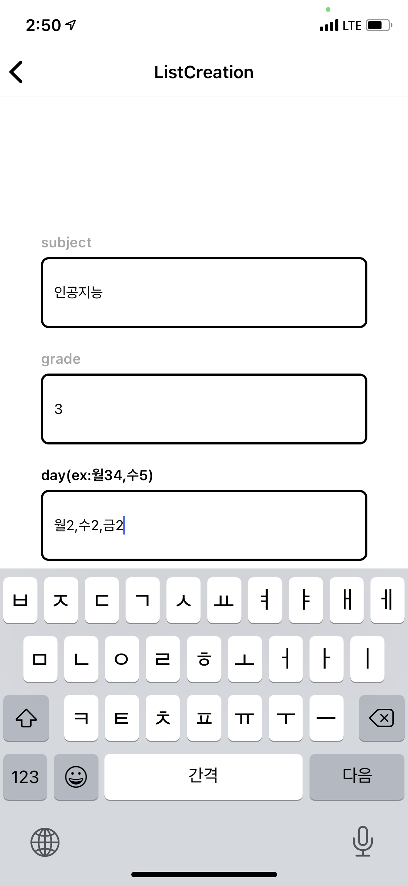
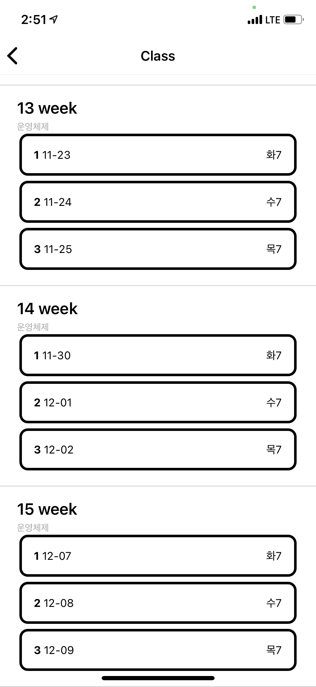

## Im in
<p align="center"></p>

*** 

## 🚵‍♀️ Motivation/개발 동기
코로나 여파로 인하여 전면 원격강의 실시로 출결 방식에서 많은 변화 요구
기존의 출결 방식의 문제점
```
1. 학생들은 정해진 시간 내에 각자이 계정으로 로그인하여 출석 코드를 입력하여 출결
-> 교수 및 학생들의 코드입력이 불편함
2. 학생의 이름을 일일이 호명
-> 시간 소요가 큼
```
> 이를 해결하기 위해서 오늘날 사람들 사이에서 꾸준히 회자되고 있는 Deep Learning 기술 중 안면 인식을 이용한다. 안면 인식을 도입한 모바일 출석 애플리케이션을 이용할 시 대리 출석의 문제점을 해결하고 출석 코드 생성 및 학생 호명 등 수업 시간 외 불필요한 시간을 최소화할 수 있다.

## 🛠 We used
<svg role="img" viewBox="0 0 24 24" xmlns="http://www.w3.org/2000/svg"><title>Django</title><path d="M11.146 0h3.924v18.166c-2.013.382-3.491.535-5.096.535-4.791 0-7.288-2.166-7.288-6.32 0-4.002 2.65-6.6 6.753-6.6.637 0 1.121.05 1.707.203zm0 9.143a3.894 3.894 0 00-1.325-.204c-1.988 0-3.134 1.223-3.134 3.365 0 2.09 1.096 3.236 3.109 3.236.433 0 .79-.025 1.35-.102V9.142zM21.314 6.06v9.098c0 3.134-.229 4.638-.917 5.937-.637 1.249-1.478 2.039-3.211 2.905l-3.644-1.733c1.733-.815 2.574-1.53 3.109-2.625.561-1.121.739-2.421.739-5.835V6.059h3.924zM17.39.021h3.924v4.026H17.39z"/></svg>

### 📚 Mobile App Architecture/모바일 앱 구조


### 🌳 Object Tree


## 🌳 Algorithm

> 학습을 하기 위해서 설정에서 얼굴 등록을 해야 하는데, 사용자는 얼굴 등록 시 모바일 카메라를 통하여 10장의 본인 사진을 촬영한다. 촬영 시 AWS EC2의 로컬 media/face 폴더로 계정(학번).jpg 파일이 저장된다. 매일 자정에 수동으로 media 폴더 내에 들어온 학생들의 사진은 일괄적으로 학습을 진행한다. 학습을 한 모델은 Im_in.pt 파일로 생성시킨다. 


> 출석 check를 할 시에는 모바일 애플리케이션의 카메라에서 한 장의 본인 사진을 필요로 한다. 사진들은 media의 check/ 폴더로 학번.jpg 형태로 저장된다. Request method가 POST방식으로 사진이 들어올 때마다 사진을 예측하여 얼굴이 들어온 학번과 예측 결과를 mobile로 출결 처리를 하도록 [‘학번’, ‘True or False’] 를 반환한다. 전달받은 값을 이용해서 firebase에 저장된 일자와 출결 현황을 갱신한다. 

***

### 📱 Demo/앱 화면
|___Sign In___|___Sign Up___|___Login approved___|___List___|
|-------------|-------------|-------------|-------------|
|||||
|___Settings___|___List Creation___|___Before check___|___checked___|
|||||
<!-- |___After check___|___Check___|___Main___|___List___|
|-------------|-------------|-------------|-------------| -->


## 🥅 what we achieved/성과
- 한국정보과학회 논문 ___accepted___
- Made youtube app promotional video


### 🎥 Youtube link
[Youtube](https://www.youtube.com/watch?v=zWzItsJUxJQ&t=254s)

***

> written by [이현동](https://github.com/LEEHYUNDONG)